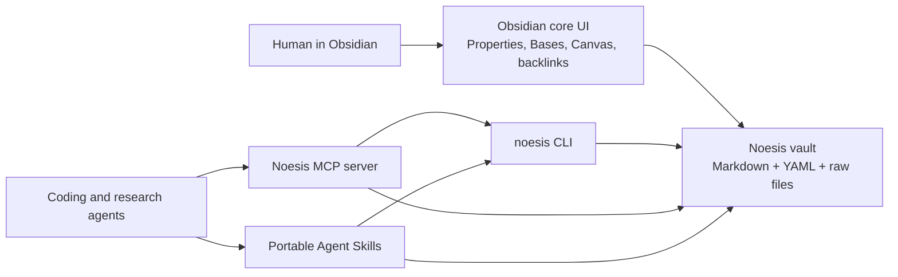

# Noesis Local-First Obsidian Interface

Status: draft  
Date: 2026-05-29  
Scope: first slice for a local-first Noesis interface

## Starting Point

Noesis is a human-agent memory system built around this lifecycle:

```text
sources -> evidence -> claims -> synthesis -> reviewed knowledge -> operational context
```

The first interface should make that lifecycle inspectable by a human in
Obsidian while leaving agents a stable file contract they can use without
opening Obsidian.

The durable source of truth is the vault: ordinary Markdown files with YAML
properties. Obsidian is the human workbench. The CLI, MCP server, and portable
Agent Skills are agent-facing adapters over the same files.

## Research Snapshot

Research date: 2026-05-29.

Obsidian core now covers most of the initial product surface Noesis needs:

- [Properties](https://obsidian.md/help/properties) expose YAML frontmatter as
  typed note metadata.
- [Bases](https://obsidian.md/help/bases) provide database-like views over
  notes from core Obsidian.
- [Canvas](https://obsidian.md/help/plugins/canvas) provides an inspectable
  visual map over notes and files.
- [Templates](https://obsidian.md/help/plugins/templates) can create simple
  note skeletons without a community plugin.
- [Backlinks](https://obsidian.md/help/plugins/backlinks), links, search, and
  graph views are enough for first-pass traceability.

Community plugins are useful, but should be treated as optional adapters. The
initial design should not depend on plugin-specific query languages or plugin
APIs because agents can work more reliably against files than against a running
Obsidian app.

Security note: Obsidian's [plugin security guidance](https://obsidian.md/help/plugin-security)
says community plugins run with Obsidian's access level and can access local
files or the network. This reinforces the adapter decision.

Agent integration paths worth preserving:

- direct file access for local CLI commands;
- an MCP server that exposes curated vault operations to agents;
- portable Agent Skills that describe the lifecycle workflow and can fall back
  to direct Markdown edits;
- optional Obsidian app adapters, such as REST or active-note integrations,
  when the product needs the currently open note or interactive UI state.

## Plugin Decision Matrix

| Capability | Candidate | Type | Initial role | Decision | Rationale and tradeoffs |
| --- | --- | --- | --- | --- | --- |
| Durable notes | Markdown files in an Obsidian vault | Core file model | Source of truth | Required | Portable, local-first, easy for humans and agents to inspect. |
| Structured metadata | Properties | Core | Source of truth for lifecycle state | Required | Maps to YAML frontmatter, so CLI and MCP can parse it without Obsidian. |
| Human review tables | Bases | Core | Review queue and knowledge dashboards | Required | Covers the first dashboard need without Dataview. Keep Base files as views, not storage. |
| Lifecycle map | Canvas | Core | Visual trace from source to context | Recommended | Useful for human inspection and demos; underlying notes remain authoritative. |
| Basic note creation | Templates | Core | Manual human templates | Recommended | Good enough for first slice. Agent Skills can use the same templates as examples. |
| Navigation and traceability | Backlinks, outgoing links, search, graph | Core | Human browse and audit | Recommended | No extra dependency; reinforces wikilink-based provenance. |
| Source capture from browser | [Obsidian Web Clipper](https://obsidian.md/help/web-clipper) | Official extension | Capture adapter | Optional | Useful for web research capture, but not required for file-backed ingest. |
| Query dashboards | [Dataview](https://github.com/blacksmithgu/obsidian-dataview) | Community plugin | Advanced view adapter | Optional later | Powerful and common, but a plugin query language should not become the contract. Bases first. |
| Review tasks | [Tasks](https://github.com/obsidian-tasks-group/obsidian-tasks) | Community plugin | Task adapter | Optional later | Useful for task semantics, but first slice can use `review_state` properties and Bases. |
| Advanced templates | [Templater](https://github.com/SilentVoid13/Templater) | Community plugin | Automation adapter | Deferred | Useful once human capture patterns stabilize. Too much behavior for the first contract. |
| Quick capture macros | QuickAdd | Community plugin | Capture adapter | Deferred | Useful for power users; not needed before CLI ingest exists. |
| Git sync from Obsidian | Obsidian Git | Community plugin | Backup/sync adapter | Optional | Normal git remains the primary automation surface. This can help humans who live in Obsidian. |
| Bibliographic capture | Zotero Integration | Community plugin | Research-domain adapter | Deferred | Important for academic workflows, but domain-specific. |
| Board-style review | Kanban | Community plugin | Alternate review UI | Deferred | Nice view, but Bases plus properties are enough for initial queueing. |
| Obsidian app API | [Local REST API with MCP](https://github.com/coddingtonbear/obsidian-local-rest-api) or similar plugins | Community plugin | Active-app adapter | Optional later | Useful for "current note" workflows and existing MCP bridges. Not needed for durable file operations. |
| Custom Noesis plugin | New Obsidian plugin | Custom code | Product-specific UI | Deferred | Not justified yet. Build only if core Bases, Canvas, and external adapters cannot support review. |

## Proposed Vault Schema

The example vault lives at `examples/noesis-vault`. A real vault can use the
same schema at its root.

```text
raw/                    immutable captured source files
sources/                one source note per raw source or external source
evidence/               atomic evidence extracted from sources
claims/                 source-backed interpretations built from evidence
syntheses/              cross-claim summaries and arguments
review/                 review queue, review decisions, reviewer notes
knowledge/              reviewed knowledge that can guide future work
context/                focused operational context packages for agents
stale/                  stale or superseded memory retained for traceability
archive/history/        historical lifecycle records and retired context
_bases/                 Obsidian Base views
_canvas/                Obsidian Canvas maps
_dashboards/            human-facing dashboard notes
_templates/             copyable note templates
```

### Required Properties

Every Noesis note should have these YAML properties:

| Property | Type | Purpose |
| --- | --- | --- |
| `title` | text | Human-readable title. |
| `noesis_id` | text | Stable local identifier, usually `type-slug`. |
| `type` | text | One of `source`, `evidence`, `claim`, `synthesis`, `review`, `reviewed-knowledge`, `operational-context`, `stale-memory`, `archived-history`, or `dashboard`. |
| `lifecycle_stage` | text | One of `source`, `evidence`, `claim`, `synthesis`, `review`, `knowledge`, `context`, `stale`, `archive`. |
| `status` | text | Current lifecycle status, such as `captured`, `extracted`, `draft`, `needs-review`, `reviewed`, `active`, `stale`, `superseded`, `archived`. |
| `review_state` | text | `none`, `ready-for-review`, `in-review`, `changes-requested`, `approved`, or `reviewed`. |
| `confidence` | text | `unknown`, `low`, `medium`, or `high`. |
| `created` | date | Creation date. |
| `updated` | date | Last material update date. |
| `tags` | list | Plain tags for Obsidian Properties and Bases. |

Use flat YAML. Avoid nested metadata because Obsidian Properties and simple
agent parsers handle flat fields more predictably.

Dashboard notes are interface notes, not lifecycle memory items. They can use
`type: dashboard` with `review_state: none` so they remain inspectable while
staying out of lifecycle and review Base results.

### Relationship Properties

Use wikilinks in list properties so humans can inspect provenance in Obsidian
and agents can parse links mechanically.

| Property | Used by | Purpose |
| --- | --- | --- |
| `raw_path` | source | Relative path to immutable raw material. |
| `original_url` | source | External source URL when known. |
| `source_date` | source | Date represented by the source when known. |
| `sources` | evidence and above | Supporting source notes. |
| `evidence` | claim and above | Supporting evidence notes. |
| `claims` | synthesis and above | Supporting claim notes. |
| `syntheses` | reviewed knowledge and context | Supporting synthesis notes. |
| `reviewed_knowledge` | operational context | Knowledge notes used as current context. |
| `supersedes` | stale, knowledge, context | Older notes this note replaces. |
| `superseded_by` | stale, old knowledge | Newer notes that replace this note. |
| `reviewer` | review | Human or agent reviewer. |
| `reviewed_at` | review and knowledge | Review date. |
| `next_review` | review, knowledge, context | Date for staleness check. |

## Architecture



The vault is the contract. Obsidian, CLI, MCP, and skills are replaceable
interfaces over that contract.

### CLI Boundary

The first CLI should provide small commands that create and validate vault
files. It should not require Obsidian to be running.

First useful commands:

| Command | Purpose |
| --- | --- |
| `noesis vault init <path>` | Create the folder schema, Bases, dashboard, and templates. |
| `noesis ingest source --vault <path> --file <path> --title <title>` | Copy immutable raw source and create a source note. |
| `noesis extract evidence --source <source-id>` | Create draft evidence notes from a source note. |
| `noesis propose claim --evidence <id...>` | Create a claim note grounded in evidence. |
| `noesis synthesize --claims <id...>` | Create a synthesis note from claims. |
| `noesis review queue` | List notes where `review_state` requires attention. |
| `noesis review approve <note-id>` | Write a review note and update reviewed state. |
| `noesis context build --scope <scope> --purpose <purpose>` | Generate focused operational context from reviewed knowledge only, with stale/superseded exclusions. |
| `noesis trace <note-id>` | Print source -> evidence -> claim -> synthesis -> knowledge lineage. |
| `noesis lint vault` | Validate frontmatter, broken links, lifecycle status, and stale review dates. |

### MCP Boundary

The first MCP server exposes curated tools rather than raw filesystem access.
Tools call the same parser, validator, lineage tracer, review queue, context
builder, and lifecycle write functions as the CLI. MCP is an adapter over the
vault contract; it is not a custom Obsidian plugin, a database, or a second
schema.

First useful tools:

| Tool | Purpose |
| --- | --- |
| `noesis_lint_vault` | Validate required folders, flat YAML properties, lifecycle values, wikilinks, Base files, Canvas files, and context exclusions. |
| `noesis_search_notes` | Search notes by text, type, lifecycle stage, status, and review state. |
| `noesis_get_note` | Return a note by `noesis_id`, filename stem, path, alias, or wikilink target, including parsed properties and body. |
| `noesis_get_review_queue` | Return notes that need human or agent review. |
| `noesis_trace_lineage` | Return connected source, evidence, claim, synthesis, review, knowledge, context, stale memory, and archive lineage. |
| `noesis_build_context` | Return current operational context from reviewed knowledge, excluding stale and superseded notes. |
| `noesis_ingest_source` | Copy immutable raw source material and create a linked source note. |
| `noesis_create_evidence_draft` | Create a reviewable evidence draft linked to a source note. |
| `noesis_create_claim_draft` | Create a review-ready claim draft grounded in evidence notes. |
| `noesis_create_synthesis_draft` | Create a review-ready synthesis draft grounded in claim lineage. |
| `noesis_approve_review` | Write an audit review note and mark the reviewed note approved. |
| `noesis_request_review_changes` | Write an audit review note, request changes, and invalidate affected active context where needed. |
| `noesis_promote_synthesis` | Promote an approved synthesis with review audit into reviewed knowledge. |
| `noesis_mark_memory_stale` | Mark memory stale or superseded and update context exclusions. |
| `noesis_write_context` | Write an operational context note from current reviewed knowledge. |

First useful resources:

| Resource | Purpose |
| --- | --- |
| `noesis://vault/summary` | Compact summary of the default vault. |
| `noesis://note/{note}` | Parsed note from the default vault. |

The write surface is intentionally smaller than direct file access. It only
allows lifecycle operations already implemented in `src/noesis/vault.py`, and
tool responses are structured objects rather than CLI text.

### Portable Agent Skills

Portable skills should teach agents how to use the vault contract. They should
prefer the CLI when it exists, but remain useful by directly reading and
editing Markdown if the CLI is unavailable.
Use the Agent Skills pattern of a `SKILL.md` file with YAML frontmatter and
progressively disclosed instructions, as described in
[Microsoft's Agent Skills documentation](https://learn.microsoft.com/en-us/agent-framework/agents/skills)
and compatible SKILL.md ecosystems.

Initial skill set:

| Skill | Trigger | Workflow |
| --- | --- | --- |
| `noesis-ingest` | Add source material to Noesis | Preserve raw source, create source note, extract evidence drafts. |
| `noesis-claim-review` | Review or mature Noesis memory | Check evidence support, update review state, create review note. |
| `noesis-context` | Prepare context for an agent task | Load reviewed knowledge, exclude stale/superseded notes, emit focused context. |

Skills are documentation plus small scripts/templates. They should not contain
the canonical schema. The schema belongs in the vault contract and CLI parser.

## First Slice Behavior

The first prototype is done when a human can open the example vault and see:

1. A review dashboard showing notes that need attention.
2. A Base view over lifecycle state.
3. A Canvas map showing one complete lineage.
4. Templates for another agent to create compatible notes.
5. Example notes showing raw source, source summary, evidence, claim,
   synthesis, review, reviewed knowledge, operational context, stale memory,
   and archived history.

The next implementation goal should build the CLI around that exact example
vault, then expose the same operations through MCP.
